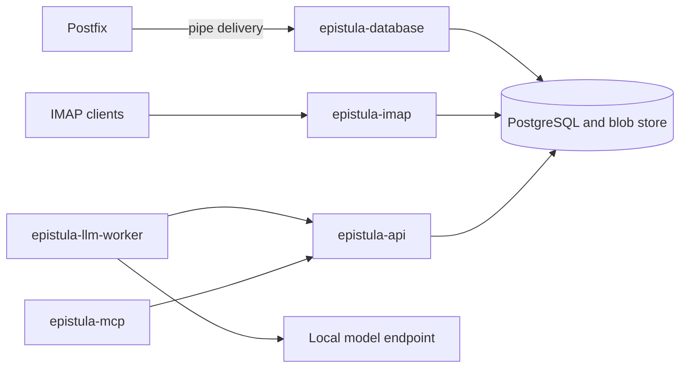

# Epistula

Epistula is a PostgreSQL-backed mail system for Postfix delivery, IMAP access,
an HTTP API, optional local-model annotation, and an MCP connector. It keeps
original messages and attachments in a content-addressed filesystem store,
with routing, mailbox state, search indexes, and annotations in PostgreSQL.

This repository begins with the complete 1.0 baseline. Each imported file has
its own introductory commit explaining its purpose; subsequent commits record
changes to Epistula. See [the baseline guide](docs/baseline.md) for the history
convention and [the architecture guide](docs/architecture.md) for a reading path.

## Components

| Directory | Executable | Responsibility |
| --- | --- | --- |
| [database](database/CLAUDE.md) | `epistula-database` | Postfix delivery, schema migrations, administrator commands, imports, recovery, and blob garbage collection |
| [imap](imap/CLAUDE.md) | `epistula-imap` | IMAP over implicit TLS, message state, APPEND, archive sorting, and optional Trash retention |
| [api](api/CLAUDE.md) | `epistula-api` | Scoped HTTP/JSON reads, search, streaming export, annotations, and archive classifications |
| [llm-worker](llm-worker/README.md) | `epistula-llm-worker` | Batch annotations and classifications through an OpenAI-compatible local-model endpoint |
| [mcp](mcp/CLAUDE.md) | `epistula-mcp` | MCP tools over the API, using stdio or Streamable HTTP |



Postfix handles SMTP reception and outbound delivery. Epistula provides storage
and access; its operator interface is the database component's `admin` command.
The worker and MCP connector use scoped API tokens and can run on separate hosts.

## Build and test

Install the Go version in [.go-version](.go-version) and a C compiler for the
race detector. Build from the complete checkout: the API and IMAP modules use
a local `replace` directive to share the database module.

```sh
make build
make test
make vet
make verify-modules
```

Executables are written inside their component directories. Cross builds use
`make build-linux`, `make build-linux-arm64`, `make build-darwin`,
`make build-darwin-arm64`, and `make build-freebsd`.

Database integration tests create and remove isolated databases on a disposable
PostgreSQL instance. The test role needs `CREATEDB`. Set the bootstrap URL to
that instance before running the suite:

```sh
MAIL_DATABASE_TEST_PG=postgres://localhost/postgres make test-integration
```

Without that variable, database integration tests skip. GitHub CI supplies a
disposable PostgreSQL service and runs the integration tests with the race
detector. [CONTRIBUTING.md](CONTRIBUTING.md) describes the development checks.

## Install and configure

Build locally, or use a release archive or the signed Linux DEB/RPM packages.
Each archive contains all five executables, configuration examples, deployment
scripts, the project license, and dependency notices.
[The release guide](docs/releases.md) covers GPG signatures and checksums;
[the Linux package guide](docs/linux-packages.md) covers accounts and services.

Configuration uses TOML. Explicit `-config` paths are recommended. Default search
paths are `/usr/local/etc/epistula/<executable>.toml`,
`/etc/epistula/<executable>.toml`, and `./<executable>.toml`. Linux packages install
`/etc/epistula/<executable>.toml`. Environment variable names (`MAIL_*`, and
`IMAP_DATABASE_*` for epistula-imap) and Prometheus metric names are stable.

Start with the examples for [delivery](database/epistula-database.toml.example),
[IMAP](imap/epistula-imap.toml.example), [the API](api/epistula-api.toml.example),
[the worker](llm-worker/epistula-llm-worker.toml.example), and
[MCP](mcp/epistula-mcp.toml.example). Set credentials, database roles, filesystem
ownership, TLS paths, and `production = true` before enabling services.
The examples are templates for an operator to configure.

The database deployment guide contains the [PostgreSQL setup](database/deploy/README.md)
and [Postfix integration](database/deploy/postfix/INSTALL.md). Follow the
[IMAP](imap/deploy/README.md) and [API](api/deploy/README.md) guides next.
The database, IMAP, and API processes must use the same mounted blob root;
database and IMAP writers must agree on `group_writable`.

The worker is optional. Its [README](llm-worker/README.md) explains model setup,
resuming exports, and scheduled rounds. The MCP connector has six read tools by
default; configuring a distinct annotation token adds its write tool.

## Operations

Back up PostgreSQL and the entire blob store together. Original message bytes
are retained, but folder placement, flags, token scopes, and annotations live
in PostgreSQL. Recovery from blobs alone cannot reconstruct all that state.
The [archive sorting runbook](ARCHIVE_SORTING.md) describes category management,
reorganization, rollback, and the opt-in archive and Trash jobs.

IMAP owns mailbox-state mutations. The API writes annotation and classification
sidecars under separate permissions. A classification can affect filing when
archive sorting is enabled; it is a different permission from advisory annotation.

The component design documents explain implementation decisions and
remaining work. [The baseline guide](docs/baseline.md) identifies their role.
MCP mock integration tests are present; acceptance against a live API and a minted
token is still an operator task recorded in [the MCP roadmap](mcp/ROADMAP.md).

## License and security

Epistula is [MIT licensed](LICENSE). Compiled dependency and Go runtime notices
are in [THIRD_PARTY_NOTICES.md](THIRD_PARTY_NOTICES.md).
Report vulnerabilities using [SECURITY.md](SECURITY.md).

Companion daemons: [Sigillum](https://github.com/ptudor/sigillum-dnssec) for DNSSEC,
and [Carillon](https://github.com/ptudor/carillon-time) for NTP.
